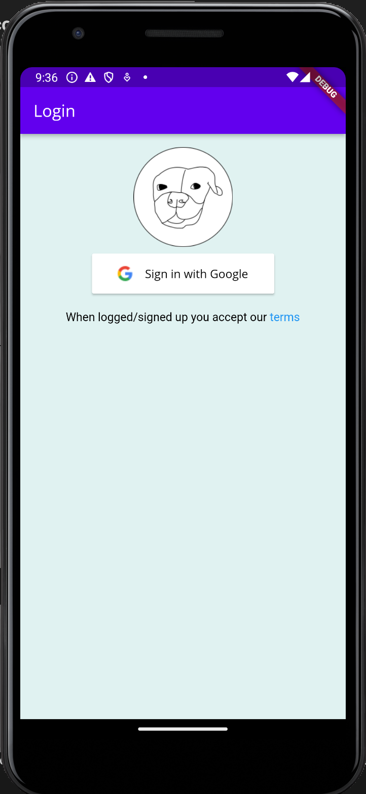
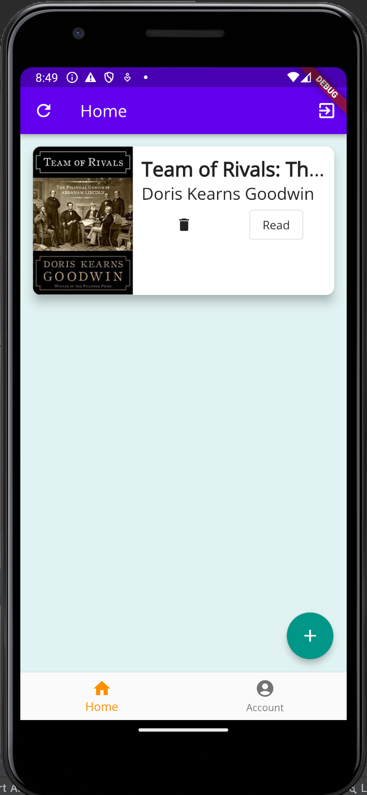

# Samlibser

### config.json
Copy the file `config.json.example` to `config.json` and fill the following fields:
- GOOGLE_CLIENT_ID: "Client Id from the OAuth 2.0 Client (you can find it in the Google Cloud Console)"
- SENTRY_DSN: "Sentry DSN (have to create an account/ask to add you into an existing one). You can check the DSN in Sentry's dashboard"

### Screenshots

